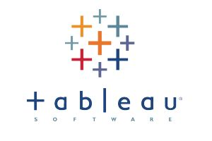

# 👋 Bonjour, je suis Allisson Kyriakidis, Data Analyst

Data Analyst chez **Decathlon Digital**, où j'allie **rigueur technique et sens business** sur des projets de pricing et d'industrialisation de pipelines de données avec dbt.

Ma force réside dans ma capacité à couvrir l'ensemble du cycle de vie de la donnée : de sa transformation à sa **visualisation interactive**, jusqu'au **data storytelling** pour vulgariser des analyses complexes auprès des décisionnaires.

---

### 🛠️ Mon Écosystème Technique

| **Data Visualisation & Reporting** | **Développement & Analyse** | **Data Engineering & Pipeline** | **Outils & Méthodologies** |
| :---: | :---: | :---: | :---: |
|     | **Python** (Pandas, NumPy, Scikit-learn)   **SQL**   **PySpark** |    **dbt**   **Airflow**   **APIs** | **Git / GitHub**   **Confluence / Jira**   **Méthodologie Agile** |

---

### 🚀 Mes Projets Vitrines

*Ici, tu mettras les liens vers tes projets épinglés, une fois qu'ils seront prêts. Voici des exemples concrets basés sur ton CV :*

-   **Dashboard Interactif de Performance des Ventes** : Une application web (Streamlit) pour explorer dynamiquement des données de ventes, inspirée de mes travaux sur Tableau chez Decathlon.
-   **Analyse Prédictive sur le Comportement Client** : Un projet de machine learning de bout-en-bout, de l'analyse exploratoire au déploiement d'un modèle simple pour prédire un KPI client.
-   **Simulation d'un Pipeline de Données avec dbt** : Un projet démontrant ma capacité à structurer et transformer des données brutes en tables d'analyse propres, prêtes à l'emploi.

---

### 📫 Me Contacter

-   **LinkedIn :** [linkedin.com/in/alisson-kyriakidis](https://linkedin.com/in/alisson-kyriakidis)
-   **Email :** [alisson.kyriakidis@gmail.com](mailto:alisson.kyriakidis@gmail.com)

<!--
**Alisson-K/Alisson-K** is a ✨ _special_ ✨ repository because its `README.md` (this file) appears on your GitHub profile.

Here are some ideas to get you started:

- 🔭 I’m currently working on ...
- 🌱 I’m currently learning ...
- 👯 I’m looking to collaborate on ...
- 🤔 I’m looking for help with ...
- 💬 Ask me about ...
- 📫 How to reach me: ...
- 😄 Pronouns: ...
- ⚡ Fun fact: ...
-->
